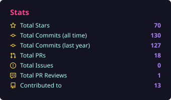
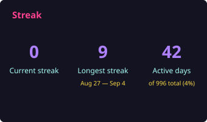
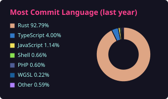
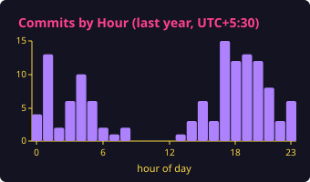
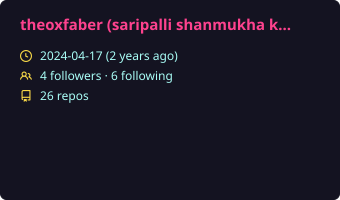
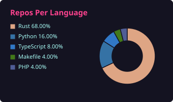
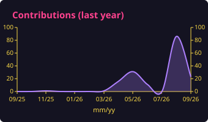
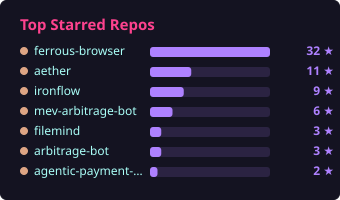

  

  systems programmer working in <b>rust</b> — browser automation, ml runtimes, solana tooling, workflow engines. 
  b.tech ai/ds @ parul university · shipping single-binary, zero-bloat tools

---

### featured builds

| repo | what | |
|------|------|---|
| [**ferrous-browser**](https://github.com/theoxfaber/ferrous-browser) | async rust cdp client — browser automation with no node.js |  |
| [**aether**](https://github.com/theoxfaber/aether) | heterogeneous compute runtime + llm inference — dag scheduler, autograd, gguf, openai server |  |
| [**ironflow**](https://github.com/theoxfaber/ironflow) | workflow orchestrator — single binary, sqlite, no daemon |  |
| [**mev-arbitrage-bot**](https://github.com/theoxfaber/mev-arbitrage-bot) | production mev engine — bellman-ford detection, revm simulation, aave flash loans |  |
| [**filemind**](https://github.com/theoxfaber/filemind) | deterministic file organizer — zero ai, zero network, full undo |  |
| [**SolVault**](https://github.com/theoxfaber/SolVault) | non-custodial solana terminal wallet — bip39, slip-0010, aes-256-gcm |  |

also: [agentic-payment-risk-governor](https://github.com/theoxfaber/agentic-payment-risk-governor) — safety gateway for agent-initiated payments · [more repos](https://github.com/theoxfaber?tab=repositories)

---

### stack

  
  
  
  
  
  
  

---

### stats

  
  
  
  

more numbers

  
  
  
  

---

  
  
  

